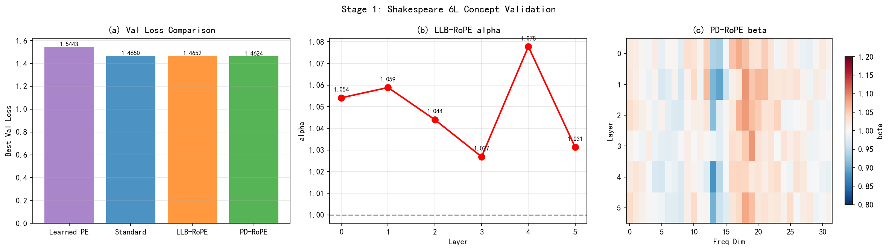
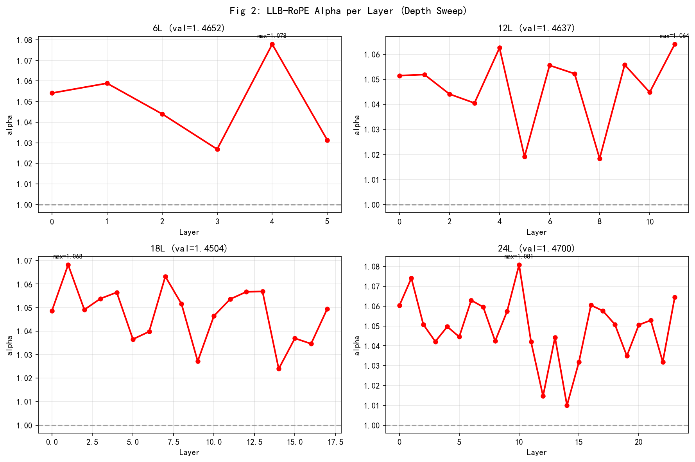
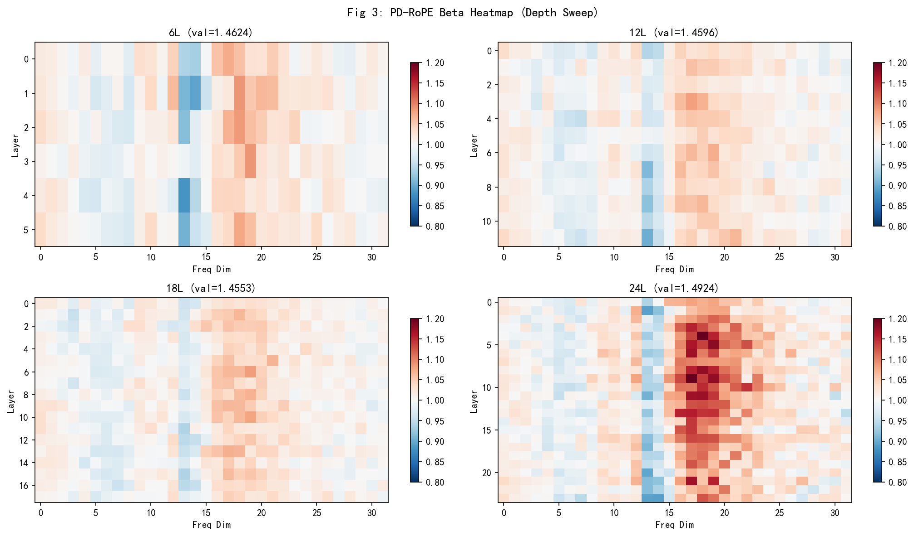
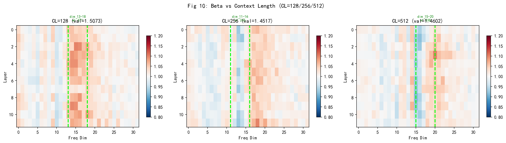
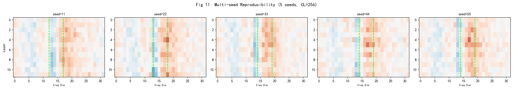

# Ide-Adaptive Position Encode

## 想法从何而来

这是我第一次自行去实践对底层架构的思考与革新。

在与Claude Sonnet深度体验了一个月之后，我决定开一个Claude会员来使用更多的额度以及Opus4.6模型，花费了150大洋。望着平常聊天几乎用不完的额度，我决定要用Claude Code去做一些小项目，于是我便开始了和Claude的探讨，最终确定了这么一个研究方向。

不过我记得我在25年初学习Transformmer架构的时候我就有对这个Position Encoding产生过疑惑，那时我只知道这个东西给Token之间添加了位置信息，而我却不知道它的底层原理，除此以外，我当时以外这个层的实现很复杂，但是我真正用代码上手实现的时候发现，其实它有点过于简单了，就是用三角函数加上原向量，慢慢转动罢了。

这些共同组成了我对这个项目探究的动力。

## 文献调研

这一步我觉得是我这个项目最失败的地方，我只是和Claude以及Gemini帮我调研了是否有前人做过类似的东西而没有仔细阅读，只确认了没有和我想法一样的文章，而且仅仅有极少的文章在做这方面的研究，我想可能有很大的原因来自于这个东西的验证本就不能是一个简简单单的事情，这个位置编码对于Loss的提升可能挺困难的，或许它对模型的提升会在下游任务上才能体现。而且得有一定的算力在非Toys数据集，以及非Toys模型，以及非Toys任务测试集上验证才有用.....

总之就是不确定性的叠加。

## 研究过程

### 核心公式

在与Gemin和Claude的激烈讨论后，我确定了两个核心方案：
**LLB-RoPE (Layer-wise Learnable Base)**：
$$\theta_i^{(l)} = (\text{base} \cdot \alpha_l)^{-2i/d}$$
- 每层 1 个可学习标量 $\alpha_l$，初始化为 1.0
- 额外参数量 = $L$（如 12 层模型只多 12 个参数）

**PD-RoPE (Per-Dimension Per-Layer)**：
$$\theta_i^{(l)} = \text{base}^{-2i/d} \cdot \beta_{l,i}$$
- 每层每频率维度各 1 个缩放因子 $\beta_{l,i}$
- 额外参数量 = $L \times d/2$（如 12 层 head_dim=64 的模型多 384 个参数）

其实相比于原本的位置编码基本改动不大，只是加入了可学习参数而不是一下子定死

### 实验过程

#### 简单跑跑

我决定先验证我的想法，于是选择了

| 参数        | 值                                           |
| ----------- | -------------------------------------------- |
| 数据集      | Shakespeare char-level (~1M chars, vocab=65) |
| 模型        | 6L, 384 hidden, 6 heads, head_dim=64         |
| context_len | 256                                          |
| 训练步数    | 1500                                         |
| 学习率      | 3e-4                                         |
| GPU         | RTX 4060 Laptop 8GB                          |

这个实验的结果如下：

| Method        | Best Val Loss | 额外参数 |
| ------------- | ------------- | -------- |
| PD-RoPE       | **1.4624**    | 192      |
| Standard RoPE | 1.4650        | 0        |
| LLB-RoPE      | 1.4652        | 6        |
| Learned PE    | 1.5443        | 98,304   |

这一切都不值得令人欣喜，因为实在是没有改变多少的Loss，甚至大多没有超过标准的位置编码。

但是当我看到PD的beta热力图的时候，感觉未免也有点规律吧，怎么会在维度上出现这么深的一条浅深带呢。于是我决定做进一步研究这个()

#### 目标转换：探究beta分布

验证"α/β 分化是否随深度增加而加强"。

固定 hidden_dim=384, n_head=6，分别跑 6L/12L/18L/24L × 3 种 RoPE 方法。24L 后来补训到 3000-5000 步。

结果如下

| Method        | 6L         | 12L        | 18L    | 24L        |
| ------------- | ---------- | ---------- | ------ | ---------- |
| Standard RoPE | 1.4650     | 1.4661     | 1.4515 | 1.4864     |
| LLB-RoPE      | 1.4652     | 1.4637     | 1.4504 | **1.4700** |
| PD-RoPE       | **1.4624** | **1.4596** | 1.4553 | 1.4924     |

单看Loss似乎没什么，但是下面两张图：

这个真的有太过明显的趋势了，令人不得不注意。是一个有意思的观察。
所有的训练都在12维度左右开始进入冷淡期，最后在16维度开始爆发到最大，最后再慢慢消逝褪去（这是最明显的特征）

其实还有次明显的，在低维度但其实也算是有一定的规律。

Claude和Gemini与我说：

RoPE 中每个频率维度 $i$ 对应的"波长"（完成一次完整旋转所需的 token 数）：
$$\lambda_i = 2\pi / \theta_i = 2\pi \cdot \text{base}^{2i/d}$$

以 base=10000, head_dim=64 为例：

| Freq Dim  | 波长 (chars) | 语言单元                    |
| --------- | ------------ | --------------------------- |
| 0-5       | 6-27         | 字符/单词级                 |
| 6-9       | 35-84        | 短语/子句级                 |
| **10-15** | **112-471**  | **句子/发言轮次（异常区）** |
| 16-20     | 628-1987     | 场景片段                    |
| 21-31     | 2650-47117   | 完整场景/文档               |

#### 疯狂beta

**预测 1（β 异常带频段偏移）**：
- Shakespeare char-level 异常带在 freq dim 10-15
- GPT-2 BPE 压缩率 ≈ 3.7x
- 预测：异常带偏移至 freq dim 6-10

**预测 2（PD-RoPE loss gap 翻正）**：
- Shakespeare 24L 上 PD-RoPE 过拟合（gap = -0.0060）
- OpenWebText 数据量增大 ~9000 倍
- 预测：24L gap 翻正

这次升级了配置，我们使用更大的OpenWebText数据集

| 参数       | 值                                                |
| ---------- | ------------------------------------------------- |
| 数据集     | OpenWebText (100M tokens, GPT-2 BPE, vocab=50257) |
| 深度       | 12L, 24L                                          |
| 训练步数   | 5000                                              |
| GPU        | RTX 4060 Laptop 8GB                               |
| batch_size | 12L: 16×2=32, 24L: 8×4=32                         |

| Method        | 12L    | 24L    |
| ------------- | ------ | ------ |
| Standard RoPE | 4.8170 | 4.7827 |
| PD-RoPE       | 4.8152 | 4.7816 |

**预测 1：未确认。** Shakespeare 和 OWT 的异常带均位于 dim 13-18，偏移量为 0。异常带追踪的不是语言单元，而是频率空间的某种固有结构（后来确认是 context_len）。

**预测 2**：PD-RoPE 24L gap 从 -0.0060 翻正为 +0.0011。过拟合确实由数据量不足导致。但极弱啊。感觉是波动...

**β 训练动态确认稳定收敛。** 各 freq dim 的 β 单调变化并趋于稳定，不是随机游走。异常带从训练早期就出现。

所以beta的异常到底和什么有关联呢

---

#### beta异常原因？

OWT 实验中异常带没有偏移（预测 1 失败），促使重新思考异常带到底在追踪什么。与ai讨论后提出了一个猜测：**β 异常带追踪的是训练窗口长度（context_len），而非语言结构。**

计算验证：
- freq dim 13 的波长 λ₁₃ ≈ 265 chars → 极其接近 context_len = 256

##### 实验验证

于是在 Shakespeare 12L 上，只改 context_len = 128 / 256 / 512，跑 PD-RoPE。

结果如下：

| context_len | 异常带中心维度 | 中心波长 λ* | ε = \|λ* - CL\| / CL |
| ----------- | -------------- | ----------- | -------------------- |
| 128         | dim 10         | 112         | 12.7%                |
| 256         | dim 13         | 265         | 3.5%                 |
| 512         | dim 15         | 471         | 8.0%                 |

**异常带位置精确追踪 context_len 的变化。** 三个点方向一致，量级匹配。

##### 这个发现解释了之前所有困惑

- 为什么 OWT（BPE）和 Shakespeare（char）的异常带在同一位置 → 因为两者的 context_len 都是 256
- 为什么异常带和"语言单元"无关 → 因为它追踪的是训练窗口，不是文本结构
- 为什么异常带在所有深度上都存在 → 因为 context_len 对所有层都一样

##### 多种子复现

5 个随机种子（seed 11, 22, 33, 44, 55），Shakespeare 12L CL=256：

- 异常带中心维度均值 = 13.164，标准差 = 0.109
- 5 个种子取整后全部为 dim 13
- 结论：**可复现**

这个时候我已经有点飘了，也许也许，这就是前人从未发现过的道路呢？但是我们很显然要继续做验证。

#### 反事实实验 — 检验因果关系

##### 实验

在 OWT 12L CL=256 上，4 组反事实：

| 实验组        | 操作                      | 目的           |
| ------------- | ------------------------- | -------------- |
| B0 控制组     | 全参数学习                | 基线           |
| B1 冻结异常带 | dim 10-18 的 β 锁定为 1.0 | 异常带是否必要 |
| B2 只学异常带 | 仅 dim 10-18 可学习       | 异常带是否足够 |
| B3 随机置乱   | β 在频率维度上 permute    | 结构是否有意义 |

结果如下

| 实验组        | Best Val Loss | Δ Loss (vs B0) |
| ------------- | ------------- | -------------- |
| B0 控制组     | 5.3578        | —              |
| B1 冻结异常带 | 5.3579        | +0.0001        |
| B2 只学异常带 | 5.3581        | +0.0003        |
| B3 随机置乱   | ~5.358        | +0.0012        |

**异常带是真实的、可复现的，但对性能没有因果影响。** 冻结它（B1）和不冻结它（B0）的差距是 0.0001——纯噪声。β 的偏离幅度只有 ~0.02，对 attention 计算的影响在数学上就是微乎其微的。

这时候我还不死心，觉得或许还有希望...或许Loss不应该是最终评判标准呢？

---

#### 最终精细化评估

##### 实验 1：按位置分解 Loss

将 loss 按 token 位置拆解，对比 Standard RoPE 和 PD-RoPE 在序列不同位置上的 loss 差异。

**结果**：

- border_mean_diff (pos 200-255) = 0.006494
- middle_mean_diff (pos 64-199) = 0.006683
- global_mean_diff = 0.006369

PD-RoPE 在全序列有微弱整体收益，但**边界区域并不比中段更强**。不支持"边界专属增益"假说。

##### 实验 2：长度外推 Perplexity

用 CL=256 训练的模型，直接在 384/512/768 上测试。

**结果**：

| Test CL | Standard PPL | PD-RoPE PPL |
| ------- | ------------ | ----------- |
| 256     | 3.970        | 3.951       |
| 384     | 4.016        | 4.060       |
| 512     | 4.017        | 4.152       |
| 768     | 4.441        | 4.685       |

PD-RoPE 在**所有外推长度上都更差**。β 异常带不是"边界平滑"，而是让模型更加过拟合到训练窗口长度。

## 研究结论

### 最终判决

| 实验        | 结果         | 含义           |
| ----------- | ------------ | -------------- |
| 按位置 loss | 无边界特异性 | β 不是边界机制 |
| 长度外推    | PD-RoPE 更差 | β 损害外推能力 |

**项目结论：β 异常带是真实但功能无关的优化足迹，项目正式收尾。**

